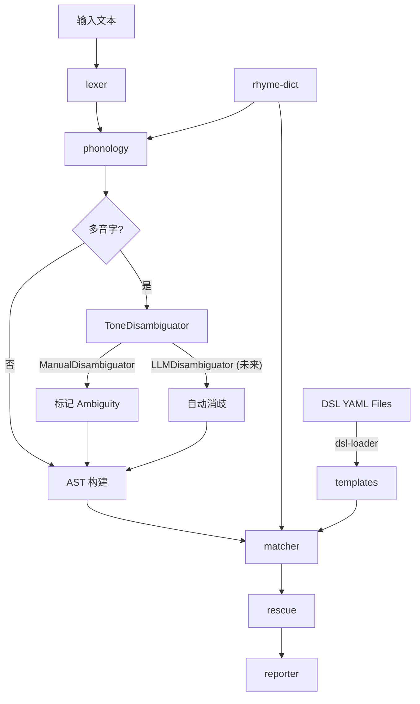
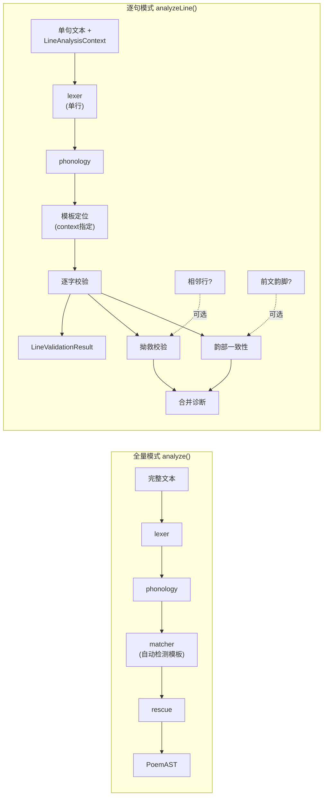

# 诗词parser

## 整体架构

整个 parser 类比编译器前端的经典流水线：**输入文本 → 词法分析 → 音韵标注 → AST 构建 → 格律模板匹配 → 拗救/韵脚校验 → 分析报告输出**。

### 目录结构

```
src/
├── core/           # AST 定义、核心类型
├── lexer/          # 词法分析（分句、分字、标点处理）
├── phonology/      # 音韵层（字→平仄/韵部映射）
├── rhyme-dict/     # 韵书数据与抽象接口
├── templates/      # 格律模板（律诗/绝句/词牌）
├── matcher/        # 模板匹配与变体检测
├── rescue/         # 拗救分析
├── analyzer/       # 顶层分析编排（orchestrator）
└── reporter/       # 结构化输出
```

### 模块依赖关系



---

## 模块详细设计

### 1. `core` — AST 与核心类型

全项目的类型基石，需要最先设计且最值得反复打磨。

- 核心类型定义

    ```tsx
    // ===== 基础枚举与约束 =====
    
    // 音调
    enum Tone { Ping = "平", Ze = "仄", Unknown = "未知" }
    
    // 音调约束（模板侧）
    type ToneConstraint =
      | { type: "fixed"; tone: Tone }
      | { type: "flexible" }            // 可平可仄（中）
      | { type: "rhyme"; group?: string } // 韵脚位
    
    // 单字校验状态
    type CharValidationStatus =
      | "pass"        // 符合模板约束
      | "fail"        // 违反模板约束
      | "flexible"    // 处于可平可仄位，任意均可
      | "rescued"     // 本身违反但被拗救覆盖
      | "unknown"     // 未匹配模板，无法校验
    
    // ===== 单字节点（增强版） =====
    
    interface CharNode {
      char: string
      tone: Tone | null                 // 实际声调（消歧后）
      toneOptions?: Tone[]             // 多音字的所有可能声调
      rhymeGroup?: string              // 实际所属韵部
      position: {
        global: number                 // 全诗第几字（从0起）
        line: number                   // 第几句（从0起）
        col: number                    // 句内第几字（从0起）
      }
      // ---- 模板侧期望（匹配后填充） ----
      expectedConstraint?: ToneConstraint  // 模板在此位置的约束
      validationStatus?: CharValidationStatus
    }
    
    // ===== 句节点（增强版，支持逐句解析） =====
    
    interface LineNode {
      chars: CharNode[]
      raw: string                       // 原始文本（含标点）
      charCount: number                 // 纯汉字数
    
      // ---- 在整首诗词中的定位 ----
      globalLineIndex: number           // 全诗中的行号（从0起）
      sectionIndex?: number             // 第几阕（词：0=上阕，1=下阕；律诗可不填）
      sectionName?: string              // 阕名，如 "上阕"、"下阕"
      lineIndexInSection?: number       // 阕内行号（从0起）
    
      // ---- 格律角色 ----
      isRhymeLine: boolean              // 是否为韵脚句
      rhymeChar?: CharNode              // 韵脚字（末字）
      expectedRhymeType?: "ping" | "ze" // 期望押平韵还是仄韵
      expectedRhymeGroup?: string       // 期望韵部（如果已知前文韵脚）
      rhymeSwitch?: "ping" | "ze"       // 是否在此行转韵
    
      // ---- 联/对仗上下文 ----
      coupletRole?: "upper" | "lower"   // 在联中的角色（出句/对句）
      coupletPairIndex?: number         // 对应的联序号
      requiresDuizhang?: boolean        // 是否要求与相邻行对仗
    
      // ---- 模板匹配结果 ----
      expectedPattern?: ToneConstraint[]  // 模板在此行的完整格律要求
      templateId?: string                 // 来自哪个模板
      templateLineName?: string           // 模板中此行的描述（可选）
    
      // ---- 本行诊断 ----
      diagnostics: Diagnostic[]           // 仅本行的诊断信息
    }
    
    // ===== 联节点 =====
    
    interface CoupletNode {
      upper: LineNode   // 出句
      lower: LineNode   // 对句
      coupletIndex: number              // 第几联（从0起）
      requiresDuizhang: boolean         // 是否要求对仗（颔联、颈联）
      diagnostics: Diagnostic[]         // 联级别的诊断（如对仗不工等）
    }
    
    // ===== 诗/词 AST 根节点 =====
    
    interface PoemAST {
      type: "lüshi" | "jueju" | "ci"
      title?: string
      lines: LineNode[]
      couplets?: CoupletNode[]          // 律诗时有
      sections?: SectionNode[]          // 词的阕结构
      templateId?: string               // 匹配到的格律模板
      rhymeDictType: RhymeDictType
      diagnostics: Diagnostic[]         // 全局诊断
      rhymeSequence?: RhymeInfo[]       // 全诗韵脚序列（用于跨行韵脚校验）
    }
    
    // ===== 阕节点（词特有） =====
    
    interface SectionNode {
      sectionIndex: number              // 第几阕
      name: string                      // 如 "上阕"、"下阕"
      lines: LineNode[]                 // 本阕的行
    }
    
    // ===== 韵脚信息 =====
    
    interface RhymeInfo {
      lineIndex: number                 // 韵脚所在行
      char: string                      // 韵脚字
      rhymeGroup: string                // 所属韵部
      tone: Tone                        // 平/仄
      isConsistent: boolean             // 是否与前文韵脚一致
    }
    
    // ===== 诊断信息 =====
    
    interface Diagnostic {
      type: "violation" | "rescue" | "info" | "ambiguity"
      severity: "error" | "warning" | "info"
      position: { line: number; col?: number }
      message: string
      rescueInfo?: RescueDetail
      // 关联上下文（便于逐句模式下追溯跨行问题）
      relatedPositions?: Array<{ line: number; col?: number; label: string }>
    }
    
    // ===== 逐句解析上下文（调用方提供） =====
    
    interface LineAnalysisContext {
      templateId: string                // 指定词牌/格律模板 ID
      variantId?: string                // 指定变体 ID（可选）
      globalLineIndex: number           // 这是全诗的第几句
      sectionIndex?: number             // 第几阕（词时需要）
      lineIndexInSection?: number       // 阕内第几句
      // 前文韵脚信息（用于校验韵部一致性）
      precedingRhymes?: Array<{
        char: string
        rhymeGroup: string
      }>
      // 相邻行（用于拗救/对仗校验）
      adjacentLines?: {
        previous?: string               // 上一句原文
        next?: string                   // 下一句原文
      }
    }
    
    // ===== 逐句解析结果 =====
    
    interface LineValidationResult {
      line: LineNode                     // 增强后的行 AST（含逐字校验状态）
      expectedPattern: ToneConstraint[]  // 模板期望的格律
      actualTones: (Tone | null)[]       // 实际平仄序列
      matchScore: number                 // 0-1 本行匹配度
      diagnostics: Diagnostic[]          // 本行诊断
      ambiguities: ToneAmbiguity[]       // 本行多音字
      rhymeCheck?: {                     // 韵脚校验结果
        isRhymeLine: boolean
        rhymeChar: string
        rhymeGroup: string
        expectedRhymeGroup?: string
        isConsistent: boolean | null     // null=无前文韵脚可比较
      }
      rescues?: RescueDetail[]           // 本行涉及的拗救
      // 上下文感知提示
      contextHints?: string[]            // 如 "本句为对句，出句第3字拗，本句第3字已救"
    }
    ```

**关键设计决策**：

- `ToneConstraint` 用 tagged union 表达"固定/可平可仄/韵脚"三态，这是模板侧的核心抽象
- `CharNode.toneOptions` 解决多音字歧义——后续 matcher 可回溯尝试
- `Diagnostic` 借鉴 LSP 的诊断模型，便于未来对接编辑器或 UI

#### 输入输出

`core` 模块本身不处理 I/O，仅提供类型定义和工具函数供其他模块导入。

- **输出**：`Tone`、`ToneConstraint`、`CharNode`、`LineNode`、`CoupletNode`、`PoemAST`、`Diagnostic` 等类型，以及 AST 节点的构建工厂函数

---

### 2. `rhyme-dict` — 韵书数据层

数据密集型模块，核心目标：给定一个汉字 + 韵书类型，返回其平仄和韵部信息。

- 类型定义

    ```tsx
    type RhymeDictType = "pingshui" | "cilin" | "zhonghua_new"
    
    interface RhymeEntry {
      char: string
      tone: Tone
      rhymeGroup: string        // 韵部名，如 "一东"、"二冬"
      pronunciation?: string    // 可选：拼音/注音
    }
    
    interface RhymeDict {
      type: RhymeDictType
      lookup(char: string): RhymeEntry[]   // 多音字返回多个
      getRhymeGroup(char: string): string[]
      isSameRhyme(a: string, b: string): boolean
    }
    ```

**数据来源**：

- 平水韵：约 9000+ 字，106 韵部，GitHub 上有 JSON/CSV 格式
- 词林正韵：戈载《词林正韵》19 部，可在平水韵基础上归并
- 中华新韵：2005 年版 14 韵部，按普通话声调分平仄

**难点**：多音字（如"重""长""行"等）需要在后续 matcher 阶段做上下文消歧，此层只提供所有可能性。

#### 输入输出

| 函数 | 输入 | 输出 |
| --- | --- | --- |
| `lookup(char)` | `char: string` — 单个汉字 | `RhymeEntry[]` — 该字在当前韵书中的所有条目（多音字返回多条） |
| `getRhymeGroup(char)` | `char: string` — 单个汉字 | `string[]` — 该字所属的所有韵部名称 |
| `isSameRhyme(a, b)` | `a: string, b: string` — 两个汉字 | `boolean` — 是否属于同一韵部 |
| `create(type)` | `type: RhymeDictType` — 韵书类型 | `RhymeDict` — 对应韵书实例 |

---

### 3. `lexer` — 词法分析

将原始文本拆分为结构化的行与字序列。

- 类型定义

    ```tsx
    interface LexLine {
      raw: string              // 原始行文本
      chars: string[]          // 去除标点后的纯汉字
      punctuation: string      // 行末标点
    }
    
    interface LexResult {
      lines: LexLine[]
      metadata: {
        totalLines: number
        charsPerLine: number[]  // 每句字数，用于后续体裁检测
        title?: string          // 如果检测到标题行
      }
    }
    ```

处理：全角/半角标点归一化、空白/换行符处理、标题行过滤等。

#### 输入输出

| 函数 | 输入 | 输出 |
| --- | --- | --- |
| `lex(input)` | `input: string` — 原始诗词文本（含标点、换行等） | `LexResult` — 结构化的行列表 + 元信息（行数、每行字数） |

---

### 4. `phonology` — 音韵标注

将 lexer 输出的字序列逐字标注平仄和韵部信息，构建初步 AST。

#### 输入输出

| 函数 | 输入 | 输出 |
| --- | --- | --- |
| `annotate(lexResult, dict)` | `lexResult: LexResult` — lexer 输出
`dict: RhymeDict` — 当前韵书 | `AnnotationResult` — 包含 `CharNode[][]`（已标注的字节点矩阵）和 `ambiguities: ToneAmbiguity[]`（多音字歧义列表） |

其中多音字歧义类型：

- ToneAmbiguity 类型

    ```tsx
    interface ToneAmbiguity {
      char: string
      position: { line: number; col: number }
      options: Array<{
        tone: Tone
        rhymeGroup: string
        pronunciation: string   // 如 "zhòng" vs "chóng"
        meaning?: string        // 可选释义辅助判断
      }>
      suggestion?: {
        preferredTone: Tone
        reason: string          // 如 "选择平声读音可使本句合律"
      }
    }
    ```

---

### 5. `templates` — 格律模板系统

领域知识最密集的模块，管理律诗/绝句/词牌的格律模板。

- 律诗/绝句模板类型

    ```tsx
    interface MeterTemplate {
      id: string                           // 如 "qilü-shouju-ping"
      type: "lüshi" | "jueju"
      name: string                         // "七律·首句入韵·平起"
      charPerLine: 5 | 7
      lineCount: 4 | 8
      pattern: ToneConstraint[][]          // [line][position]
      rhymeLineIndices: number[]           // 哪些行押韵
      variants?: string[]                  // 关联变体 ID
    }
    ```

- 词牌模板类型

    ```tsx
    interface CiTemplate {
      id: string
      name: string                         // 词牌名，如 "浣溪沙"
      aliases?: string[]                   // 别名
      sections: Array<{                    // 上阕/下阕
        lines: Array<{
          charCount: number
          pattern: ToneConstraint[]
          isRhymeLine: boolean
          rhymeType?: "ping" | "ze"       // 平韵/仄韵
        }>
      }>
      variants: CiTemplate[]              // 同一词牌的不同变体
      source?: string                     // 出处
    }
    ```

律诗/绝句只有有限组合（按五/七言、平/仄起、首句是否入韵），核心模板约 8 种。词牌方面：

- Phase 1：常见 20-30 个词牌
- Phase 2：扩展到 200+ 常用词牌
- Phase 3：全量《钦定词谱》

#### 输入输出

| 函数 | 输入 | 输出 |  |
| --- | --- | --- | --- |
| `loadMeterTemplates()` | 无 | `MeterTemplate[]` — 所有律诗/绝句模板 |  |
| `loadCiTemplates()` | 无（从 YAML DSL 文件加载） | `CiTemplate[]` — 所有已注册词牌模板 |  |
| `loadCiFromYaml(yaml)` | `yaml: string` — 单个词牌 YAML DSL 内容 | `CiTemplate` — 解析后的词牌模板 |  |
| `getCandidates(meta)` | `meta: { lineCount, charsPerLine }` — lexer 元信息 | `(MeterTemplate \ | CiTemplate)[]` — 按句数/字数粗筛后的候选模板 |

---

### 6. `matcher` — 模板匹配与变体检测

算法核心：给定已标注音韵的 AST，找到最佳匹配的格律模板。

- 类型定义

    ```tsx
    interface MatchResult {
      templateId: string
      confidence: number               // 0-1 匹配度
      toneDeviations: Array<{          // 偏离位置
        line: number
        col: number
        expected: ToneConstraint
        actual: Tone
      }>
    }
    ```

**匹配策略**：

1. 先按句数 + 每句字数粗筛候选模板
2. 逐位比对平仄，跳过 `flexible` 位
3. 韵脚校验（是否同韵部）
4. 多音字回溯：遇到冲突时尝试 `toneOptions` 中的其他声调
5. 计算偏差率，排序输出

#### 输入输出

| 函数 | 输入 | 输出 |  |
| --- | --- | --- | --- |
| `matchTemplate(ast, templates, dict)` | `ast: PoemAST` — 已标注音韵的 AST
`templates: (MeterTemplate \ | CiTemplate)[] `— 候选模板`
dict: RhymeDict` — 韵书实例 | `MatchResult[]` — 按 confidence 降序排列的匹配结果 |

---

### 7. `rescue` — 拗救分析

近体诗特有模块，检测和分析拗救现象。

- 类型定义

    ```tsx
    type RescueType =
      | "benju-zijiou"        // 本句自救（如孤平拗救）
      | "duiju-xiangjiou"     // 对句相救
      | "sansi-hujiou"        // 三四字互救
      | "guping-jiou"         // 孤平拗救（特殊本句自救）
    
    interface RescueDetail {
      type: RescueType
      naoPosition: { line: number; col: number }   // 拗的位置
      jiuPosition: { line: number; col: number }   // 救的位置
      description: string
    }
    ```

**需要覆盖的拗救规则**：

- **一三五不论，二四六分明**（基本原则 + 例外）
- **孤平拗救**：本句自救
- **对句相救**：出句某位拗，对句对应位置用相反声调救
- **大拗与小拗**的区分
- **特拗句式**（如"平平仄平仄"）

#### 输入输出

| 函数 | 输入 | 输出 |
| --- | --- | --- |
| `analyzeRescue(couplet, template, dict)` | `couplet: CoupletNode` — 一联（出句+对句）
`template: MeterTemplate` — 对应格律模板
`dict: RhymeDict` — 韵书实例 | `RescueDetail[]` — 检测到的拗救列表 |

---

### 8. `analyzer` — 顶层编排

串联所有模块的 orchestrator。

- 类型定义

    ```tsx
    interface AnalyzeOptions {
      rhymeDictType: RhymeDictType
      preferredType?: "lüshi" | "jueju" | "ci"  // 可选提示
      strictMode?: boolean                        // 严格/宽松模式
    }
    
    interface AnalysisResult {
      ast: PoemAST
      matchResults: MatchResult[]
      bestMatch: MatchResult | null
      diagnostics: Diagnostic[]
      ambiguities: ToneAmbiguity[]    // 需要用户确认的多音字
      summary: string                  // 人类可读摘要
    }
    ```

#### 输入输出

| 函数 | 输入 | 输出 |
| --- | --- | --- |
| `analyze(input, options)` | `input: string` — 原始诗词文本
`options: AnalyzeOptions` — 分析配置（韵书类型、偏好体裁、严格模式等） | `AnalysisResult` — 包含完整 AST、匹配结果、诊断信息、多音字歧义列表和摘要 |
| `analyzeLine(input, context, options)` | `input: string` — 单句原文
`context: LineAnalysisContext` — 逐句上下文（模板ID、行号、阕信息、前文韵脚、相邻行等）
`options: AnalyzeOptions` — 分析配置 | `LineValidationResult` — 包含增强 LineNode（逐字校验状态）、期望格律、实际平仄、匹配度、诊断、多音字、韵脚校验和拗救结果 |

---

### 9. `reporter` — 输出层

将分析结果转化为多种格式的可读报告。

#### 输入输出

| 函数 | 输入 | 输出 |
| --- | --- | --- |
| `toJSON(result)` | `result: AnalysisResult` | `string` — JSON 格式的结构化报告 |
| `toAnnotatedText(result)` | `result: AnalysisResult` | `string` — 逐字标注平仄的文本（含高亮违规） |
| `toCLI(result)` | `result: AnalysisResult` | `string` — CLI 彩色输出文本 |
| `toRenderData(result)` | `result: AnalysisResult` | `RenderData` — Web UI 渲染所需的结构化数据（未来） |

---

## 逐句解析模式：设计思路与核心实现

### 设计思路

逐句解析是本项目的一个重要使用场景：用户正在填词或写律诗，写到某一句时希望立即校验这一句是否合律，而不需要等整首写完再做全量分析。

这带来几个核心设计约束：

1. **单句必须能独立校验**：`LineNode` 需要携带足够的模板上下文（期望格律、韵脚要求、联角色等），不依赖遍历整棵 AST
2. **上下文可选注入**：调用方可以提供前文韵脚、相邻行等信息来启用跨行校验（拗救、韵部一致性），但缺少时也能降级为仅本句校验
3. **模板定位是前置条件**：逐句模式下，用户必须告知「这是哪个词牌/格律的第几句」，系统据此从模板中提取该行的期望格律

### 数据流对比



### 模板定位：从 context 到 expectedPattern

逐句解析的第一步是根据 `LineAnalysisContext` 从模板中精确提取该行的格律要求。

- 核心代码：resolveLineTemplate

    ```tsx
    /**
     * 根据逐句上下文，从模板库中定位当前行的格律要求
     */
    function resolveLineTemplate(
      context: LineAnalysisContext,
      templateRegistry: TemplateRegistry
    ): ResolvedLineTemplate {
      // 1. 查找模板
      const template = templateRegistry.get(context.templateId)
      if (!template) {
        throw new TemplateNotFoundError(context.templateId)
      }
    
      // 2. 如果指定了变体，使用变体；否则使用正体
      const variant = context.variantId
        ? template.variants.find(v => v.id === context.variantId)
        : template.variants[0]  // 默认正体
    
      if (!variant) {
        throw new VariantNotFoundError(context.variantId)
      }
    
      // 3. 定位到具体行
      //    支持两种定位方式：globalLineIndex 或 sectionIndex + lineIndexInSection
      let targetLine: TemplateLine
      let sectionInfo: { index: number; name: string } | undefined
    
      if (context.sectionIndex !== undefined &&
          context.lineIndexInSection !== undefined) {
        // 方式 A：通过阕+阕内行号定位（词牌推荐）
        const section = variant.sections[context.sectionIndex]
        if (!section) throw new SectionOutOfRange(context.sectionIndex)
        targetLine = section.lines[context.lineIndexInSection]
        sectionInfo = { index: context.sectionIndex, name: section.name }
      } else {
        // 方式 B：通过全局行号定位（律诗/绝句推荐）
        const allLines = variant.sections.flatMap((s, si) =>
          s.lines.map((l, li) => ({ line: l, sectionIndex: si,
            sectionName: s.name, lineIndexInSection: li }))
        )
        const entry = allLines[context.globalLineIndex]
        if (!entry) throw new LineOutOfRange(context.globalLineIndex)
        targetLine = entry.line
        sectionInfo = { index: entry.sectionIndex, name: entry.sectionName }
      }
    
      // 4. 解析 pattern 字符串为 ToneConstraint[]
      const { constraints, rhymeMarker } = parsePattern(targetLine.pattern)
    
      // 5. 计算联角色（律诗/绝句）
      const coupletInfo = resolveCoupletRole(
        context.globalLineIndex, template.type
      )
    
      return {
        templateId: template.id,
        variantId: variant.id,
        templateName: `${template.name}·${variant.name}`,
        expectedPattern: constraints,
        charCount: targetLine.charCount,
        isRhymeLine: rhymeMarker !== null,
        rhymeMarker,
        rhymeSwitch: targetLine.rhymeSwitch,
        requiresDuizhang: targetLine.duizhang ?? false,
        coupletRole: coupletInfo?.role,
        coupletPairIndex: coupletInfo?.pairIndex,
        sectionInfo,
      }
    }
    
    /**
     * 计算律诗中当前行的联角色
     * 律诗8句分4联：首联(0,1) 颔联(2,3) 颈联(4,5) 尾联(6,7)
     * 绝句4句分2联：(0,1) (2,3)
     */
    function resolveCoupletRole(
      globalLineIndex: number,
      type: "lüshi" | "jueju" | "ci"
    ): { role: "upper" | "lower"; pairIndex: number } | undefined {
      if (type === "ci") return undefined  // 词不按联分
      const pairIndex = Math.floor(globalLineIndex / 2)
      const role = globalLineIndex % 2 === 0 ? "upper" : "lower"
      return { role, pairIndex }
    }
    ```

### 逐字校验：validateChars

将实际平仄与模板期望逐位比对，生成每个字的校验状态。

- 核心代码：validateChars

    ```tsx
    /**
     * 逐字比对实际声调与模板约束
     * 返回填充了 expectedConstraint 和 validationStatus 的 CharNode[]
     */
    function validateChars(
      chars: CharNode[],
      expectedPattern: ToneConstraint[]
    ): { validatedChars: CharNode[]; score: number } {
      let matchCount = 0
      let checkableCount = 0  // 排除 flexible 的有效比对数
    
      const validatedChars = chars.map((charNode, i) => {
        const constraint = expectedPattern[i]
        if (!constraint) {
          // 超出模板长度（字数不匹配时）
          return { ...charNode,
            expectedConstraint: undefined,
            validationStatus: "unknown" as const
          }
        }
    
        let status: CharValidationStatus
    
        switch (constraint.type) {
          case "flexible":
            // 可平可仄位，任何声调都合规
            status = "flexible"
            break
    
          case "fixed":
            checkableCount++
            if (charNode.tone === null) {
              // 声调未知（多音字未消歧）
              status = "unknown"
            } else if (charNode.tone === constraint.tone) {
              status = "pass"
              matchCount++
            } else {
              // 先标记为 fail，后续 rescue 模块可能将其改为 rescued
              status = "fail"
            }
            break
    
          case "rhyme":
            // 韵脚位：声调校验 + 韵部校验（韵部在外层单独处理）
            checkableCount++
            // 韵脚位通常对平仄有隐含要求（平韵=平声，仄韵=仄声）
            status = charNode.tone !== null ? "pass" : "unknown"
            matchCount++
            break
        }
    
        return {
          ...charNode,
          expectedConstraint: constraint,
          validationStatus: status,
        }
      })
    
      const score = checkableCount > 0 ? matchCount / checkableCount : 1
      return { validatedChars, score }
    }
    ```

### 韵脚校验：validateRhyme

独立的韵脚校验逻辑，支持与前文韵脚的一致性检查。

- 核心代码：validateRhyme

    ```tsx
    interface RhymeCheckResult {
      isRhymeLine: boolean
      rhymeChar: string
      rhymeGroup: string
      expectedRhymeGroup?: string
      isConsistent: boolean | null   // null = 无前文可比较
      diagnostic?: Diagnostic
    }
    
    function validateRhyme(
      chars: CharNode[],
      resolvedTemplate: ResolvedLineTemplate,
      precedingRhymes: Array<{ char: string; rhymeGroup: string }> | undefined,
      dict: RhymeDict
    ): RhymeCheckResult | undefined {
      if (!resolvedTemplate.isRhymeLine) return undefined
    
      const lastChar = chars[chars.length - 1]
      if (!lastChar) return undefined
    
      const rhymeGroup = lastChar.rhymeGroup ?? ""
      const rhymeChar = lastChar.char
    
      // 确定期望韵部
      let expectedRhymeGroup: string | undefined
      let isConsistent: boolean | null = null
    
      if (precedingRhymes && precedingRhymes.length > 0) {
        // 取第一个韵脚确定的韵部作为基准
        expectedRhymeGroup = precedingRhymes[0].rhymeGroup
        isConsistent = dict.isSameRhyme(rhymeChar, precedingRhymes[0].char)
      }
    
      // 检查转韵情况
      if (resolvedTemplate.rhymeSwitch) {
        // 转韵行：不与前文韵脚比较，开始新的韵部
        isConsistent = null
        expectedRhymeGroup = undefined
      }
    
      // 生成诊断
      let diagnostic: Diagnostic | undefined
      if (isConsistent === false) {
        diagnostic = {
          type: "violation",
          severity: "error",
          position: { line: lastChar.position.line, col: lastChar.position.col },
          message: `韵脚「${rhymeChar}」(${rhymeGroup}) 与前文韵脚`
            + ` (${expectedRhymeGroup}) 不在同一韵部`,
          relatedPositions: precedingRhymes?.map((r, i) => ({
            line: -1,  // 由调用方填充实际行号
            label: `前文韵脚「${r.char}」(${r.rhymeGroup})`
          }))
        }
      }
    
      return {
        isRhymeLine: true,
        rhymeChar,
        rhymeGroup,
        expectedRhymeGroup,
        isConsistent,
        diagnostic,
      }
    }
    ```

### 逐句拗救校验（降级模式）

在逐句模式下，拗救校验依赖相邻行。如果调用方提供了 `adjacentLines`，则构建临时 CoupletNode 进行拗救分析；否则仅做本句级别的孤平检测。

- 核心代码：analyzeLineRescue

    ```tsx
    /**
     * 逐句模式下的拗救分析
     * - 有相邻行时：构建临时联，做完整拗救检测
     * - 无相邻行时：仅做本句级别的检测（孤平等）
     */
    function analyzeLineRescue(
      currentLine: LineNode,
      resolvedTemplate: ResolvedLineTemplate,
      adjacentLines: { previous?: string; next?: string } | undefined,
      dict: RhymeDict,
      options: AnalyzeOptions
    ): { rescues: RescueDetail[]; updatedChars: CharNode[] } {
      const rescues: RescueDetail[] = []
      let updatedChars = [...currentLine.chars]
    
      // 1. 本句级别检测：孤平
      if (resolvedTemplate.coupletRole !== undefined) {
        const guping = detectGuping(currentLine.chars, resolvedTemplate.expectedPattern)
        if (guping) {
          // 检查是否有本句自救
          const selfRescue = detectSelfRescue(
            currentLine.chars,
            resolvedTemplate.expectedPattern,
            guping
          )
          if (selfRescue) {
            rescues.push(selfRescue)
            // 将被救的字标记为 rescued
            updatedChars = markAsRescued(updatedChars, [guping.col])
          } else {
            // 孤平未救，生成 violation
            // （但如果有对句信息，可能是对句相救）
          }
        }
      }
    
      // 2. 跨行级别检测：对句相救
      if (adjacentLines && resolvedTemplate.coupletRole) {
        const pairText = resolvedTemplate.coupletRole === "upper"
          ? adjacentLines.next     // 当前是出句，对句是下一行
          : adjacentLines.previous // 当前是对句，出句是上一行
    
        if (pairText) {
          // 对相邻行做音韵标注
          const pairLex = lex(pairText)
          const pairAnnotation = annotate(pairLex, dict)
          const pairChars = pairAnnotation.chars[0]  // 单行
    
          // 构建临时联
          const tempCouplet: CoupletNode = resolvedTemplate.coupletRole === "upper"
            ? { upper: currentLine, lower: buildTempLine(pairChars),
                coupletIndex: resolvedTemplate.coupletPairIndex ?? 0,
                requiresDuizhang: resolvedTemplate.requiresDuizhang,
                diagnostics: [] }
            : { upper: buildTempLine(pairChars), lower: currentLine,
                coupletIndex: resolvedTemplate.coupletPairIndex ?? 0,
                requiresDuizhang: resolvedTemplate.requiresDuizhang,
                diagnostics: [] }
    
          // 用完整的拗救分析器
          const coupletRescues = analyzeRescue(
            tempCouplet,
            resolvedTemplate as any,  // 需要完整模板
            dict
          )
          rescues.push(...coupletRescues)
    
          // 更新当前行中被救的字
          const rescuedCols = coupletRescues
            .filter(r => r.jiuPosition.line === currentLine.globalLineIndex)
            .map(r => r.jiuPosition.col)
          updatedChars = markAsRescued(updatedChars, rescuedCols)
        }
      }
    
      return { rescues, updatedChars }
    }
    
    /**
     * 检测孤平：在「仄仄平平仄仄平」类句型中，
     * 如果除韵脚外只有一个平声字，则为孤平
     */
    function detectGuping(
      chars: CharNode[],
      pattern: ToneConstraint[]
    ): { col: number } | null {
      // 仅对「...平平...平△」句型检测（对句/下句）
      // 统计除韵脚外的平声字数
      const nonRhymeChars = chars.slice(0, -1)  // 去掉韵脚
      const pingCount = nonRhymeChars.filter(c => c.tone === Tone.Ping).length
    
      if (pingCount <= 1) {
        // 只有0或1个平声字（除韵脚外），可能孤平
        const pingIndex = nonRhymeChars.findIndex(c => c.tone === Tone.Ping)
        return pingIndex >= 0 ? { col: pingIndex } : null
      }
      return null
    }
    
    function markAsRescued(chars: CharNode[], cols: number[]): CharNode[] {
      return chars.map((c, i) =>
        cols.includes(i) && c.validationStatus === "fail"
          ? { ...c, validationStatus: "rescued" as const }
          : c
      )
    }
    ```

### 顶层入口：analyzeLine

串联上述所有步骤的 orchestrator 函数。

- 核心代码：analyzeLine 完整实现

    ```tsx
    /**
     * 逐句解析入口
     *
     * @example
     * // 解析浣溪沙下阕第一句
     * const result = analyzeLine(
     *   "无可奈何花落去",
     *   {
     *     templateId: "huanxisha",
     *     globalLineIndex: 3,
     *     sectionIndex: 1,
     *     lineIndexInSection: 0,
     *     precedingRhymes: [
     *       { char: "杯", rhymeGroup: "十灰" },
     *       { char: "来", rhymeGroup: "十灰" },
     *     ],
     *   },
     *   { rhymeDictType: "pingshui" }
     * )
     */
    async function analyzeLine(
      input: string,
      context: LineAnalysisContext,
      options: AnalyzeOptions
    ): Promise<LineValidationResult> {
      const dict = createRhymeDict(options.rhymeDictType)
      const templateRegistry = getTemplateRegistry()
      const disambiguator = getDisambiguator()  // DI
    
      // Step 1: 模板定位
      const resolved = resolveLineTemplate(context, templateRegistry)
    
      // Step 2: 词法分析（单行）
      const lexResult = lex(input)
      if (lexResult.lines.length === 0) {
        throw new EmptyInputError()
      }
      const lexLine = lexResult.lines[0]
    
      // Step 3: 字数校验
      const charCountDiagnostics: Diagnostic[] = []
      if (lexLine.chars.length !== resolved.charCount) {
        charCountDiagnostics.push({
          type: "violation",
          severity: "error",
          position: { line: context.globalLineIndex },
          message: `字数不匹配：期望 ${resolved.charCount} 字，`
            + `实际 ${lexLine.chars.length} 字`,
        })
      }
    
      // Step 4: 音韵标注
      const annotation = annotate(lexResult, dict)
      const charNodes = annotation.chars[0]  // 单行
      const ambiguities = annotation.ambiguities
    
      // Step 5: 多音字消歧尝试
      for (const amb of ambiguities) {
        const result = await disambiguator.disambiguate(
          amb.char,
          { fullText: input, lineText: input, position: amb.position }
        )
        if (result) {
          // 自动消歧成功
          charNodes[amb.position.col].tone = result.tone
        }
        // 否则保留为 ambiguity，提示用户
      }
    
      // Step 6: 逐字校验
      const { validatedChars, score } = validateChars(
        charNodes, resolved.expectedPattern
      )
    
      // Step 7: 韵脚校验
      const rhymeCheck = validateRhyme(
        validatedChars, resolved, context.precedingRhymes, dict
      )
    
      // Step 8: 拗救分析
      const lineNode = buildLineNode(
        validatedChars, lexLine.raw, context, resolved
      )
      const { rescues, updatedChars } = analyzeLineRescue(
        lineNode, resolved, context.adjacentLines, dict, options
      )
    
      // Step 9: 收集诊断
      const diagnostics: Diagnostic[] = [
        ...charCountDiagnostics,
        ...validatedChars
          .filter(c => c.validationStatus === "fail")
          .map(c => ({
            type: "violation" as const,
            severity: "error" as const,
            position: { line: context.globalLineIndex, col: c.position.col },
            message: `第${c.position.col + 1}字「${c.char}」`
              + `实际${c.tone}声，期望${formatConstraint(c.expectedConstraint!)}`,
          })),
        ...(rhymeCheck?.diagnostic ? [rhymeCheck.diagnostic] : []),
        ...ambiguities
          .filter(a => charNodes[a.position.col].tone === null)
          .map(a => ({
            type: "ambiguity" as const,
            severity: "warning" as const,
            position: { line: context.globalLineIndex, col: a.position.col },
            message: `「${a.char}」为多音字，不同读音跨越平仄，需确认`,
          })),
      ]
    
      // Step 10: 生成上下文提示
      const contextHints: string[] = []
      if (resolved.coupletRole) {
        contextHints.push(
          `本句为${resolved.coupletRole === "upper" ? "出句" : "对句"}`
          + `（第${(resolved.coupletPairIndex ?? 0) + 1}联）`
        )
      }
      if (resolved.requiresDuizhang) {
        contextHints.push("本联要求对仗")
      }
      if (rescues.length > 0) {
        rescues.forEach(r => contextHints.push(r.description))
      }
    
      // 构建最终 LineNode
      const finalLine: LineNode = {
        ...lineNode,
        chars: updatedChars,
        diagnostics,
      }
    
      return {
        line: finalLine,
        expectedPattern: resolved.expectedPattern,
        actualTones: updatedChars.map(c => c.tone),
        matchScore: score,
        diagnostics,
        ambiguities: ambiguities.filter(
          a => charNodes[a.position.col].tone === null
        ),
        rhymeCheck: rhymeCheck ? {
          isRhymeLine: rhymeCheck.isRhymeLine,
          rhymeChar: rhymeCheck.rhymeChar,
          rhymeGroup: rhymeCheck.rhymeGroup,
          expectedRhymeGroup: rhymeCheck.expectedRhymeGroup,
          isConsistent: rhymeCheck.isConsistent,
        } : undefined,
        rescues,
        contextHints,
      }
    }
    
    // ===== 辅助函数 =====
    
    function buildLineNode(
      chars: CharNode[],
      raw: string,
      context: LineAnalysisContext,
      resolved: ResolvedLineTemplate
    ): LineNode {
      return {
        chars,
        raw,
        charCount: chars.length,
        globalLineIndex: context.globalLineIndex,
        sectionIndex: context.sectionIndex,
        sectionName: resolved.sectionInfo?.name,
        lineIndexInSection: context.lineIndexInSection,
        isRhymeLine: resolved.isRhymeLine,
        rhymeChar: resolved.isRhymeLine ? chars[chars.length - 1] : undefined,
        expectedRhymeType: resolved.rhymeMarker?.type as "ping" | "ze" | undefined,
        rhymeSwitch: resolved.rhymeSwitch,
        coupletRole: resolved.coupletRole,
        coupletPairIndex: resolved.coupletPairIndex,
        requiresDuizhang: resolved.requiresDuizhang,
        expectedPattern: resolved.expectedPattern,
        templateId: resolved.templateId,
        templateLineName: resolved.templateName,
        diagnostics: [],
      }
    }
    
    function formatConstraint(constraint: ToneConstraint): string {
      switch (constraint.type) {
        case "fixed": return constraint.tone === Tone.Ping ? "平声" : "仄声"
        case "flexible": return "可平可仄"
        case "rhyme": return "韵脚"
      }
    }
    ```

### 调用示例

#### 示例 1：浣溪沙下阕第一句

```tsx
const result = await analyzeLine(
  "无可奈何花落去",
  {
    templateId: "huanxisha",
    globalLineIndex: 3,        // 全诗第4句（下阕第1句）
    sectionIndex: 1,           // 下阕
    lineIndexInSection: 0,     // 阕内第1句
    precedingRhymes: [
      { char: "杯", rhymeGroup: "十灰" },
      { char: "来", rhymeGroup: "十灰" },
      { char: "徊", rhymeGroup: "十灰" },
    ],
    adjacentLines: {
      next: "似曾相识燕归来",   // 下一句（用于对仗校验）
    },
  },
  { rhymeDictType: "pingshui" }
)

// result.expectedPattern → [中, 仄, 中, 平, 平, 仄, 仄]
// result.actualTones    → [平, 仄, 仄, 平, 平, 仄, 仄]
// result.matchScore     → 1.0（完全合律）
// result.rhymeCheck     → undefined（本句非韵脚句）
// result.diagnostics    → []（无问题）
// result.contextHints   → ["本句为出句（第2联）"]
```

#### 示例 2：七律第四句（含拗救）

```tsx
const result = await analyzeLine(
  "一行白鹭上青天",
  {
    templateId: "qilü-shouju-ping",
    globalLineIndex: 3,
    adjacentLines: {
      previous: "两个黄鹂鸣翠柳",  // 出句
    },
    precedingRhymes: [
      { char: "前", rhymeGroup: "一先" },
    ],
  },
  { rhymeDictType: "pingshui" }
)

// result.contextHints → ["本句为对句（第2联）", ...]
// result.rhymeCheck.isConsistent → true（"天"与"前"同韵部）
// result.line.chars 中每个字都有 validationStatus
```

#### 示例 3：含多音字的场景

```tsx
const result = await analyzeLine(
  "重阳独酌杯中酒",
  {
    templateId: "qilü-shouju-ze",
    globalLineIndex: 0,
  },
  { rhymeDictType: "pingshui" }
)

// result.ambiguities → [
//   {
//     char: "重",
//     position: { line: 0, col: 0 },
//     options: [
//       { tone: Ping, pronunciation: "chóng", rhymeGroup: "二冬" },
//       { tone: Ze, pronunciation: "zhòng", rhymeGroup: "二宋" },
//     ],
//     suggestion: {
//       preferredTone: Ping,
//       reason: "选择平声可使本句合律（平平仄仄仄平平）"
//     }
//   }
// ]
```

---

## 多音字处理策略

### 当前阶段：显式提示用户

当检测到多音字且不同读音跨越平仄时，生成 `ToneAmbiguity` 提示用户确认。

**输出示例**：

> ⚠ 第2句第3字「重」为多音字，不同读音跨越平仄：
· chóng（平声）— 韵部：一东 — 义：重复、再次
· zhòng（仄声）— 韵部：二宋 — 义：重量、重要
💡 建议：取平声 chóng，可使本句合律（中平中仄仄平平）
>

### 后续演进：接入 Tiny LLM

通过依赖注入预留消歧接口：

- 消歧接口定义

    ```tsx
    interface ToneDisambiguator {
      disambiguate(
        char: string,
        context: {
          fullText: string
          lineText: string
          position: { line: number; col: number }
        }
      ): Promise<{
        tone: Tone
        pronunciation: string
        confidence: number
      } | null>
    }
    
    // 默认实现：不消歧，返回 null 触发用户提示
    class ManualDisambiguator implements ToneDisambiguator {
      async disambiguate() { return null }
    }
    
    // 未来实现：接入 tiny LLM 做语义消歧
    class LLMDisambiguator implements ToneDisambiguator {
      constructor(private model: TinyLLM) {}
      async disambiguate(char, context) {
        // 调用 tiny LLM 做语义消歧
      }
    }
    ```

---

## 词牌 DSL 设计（CiPu Schema）

### 设计目标

1. **人类可读可写**：诗词爱好者/研究者能直接贡献词牌数据，无需编程
2. **机器可解析**：能直接被 parser 加载为 `CiTemplate` 类型
3. **表达力完备**：覆盖可平可仄、韵脚、叶韵、平仄韵转换、对仗要求等
4. **变体友好**：一个文件描述同一词牌的正体 + 所有变体

### 格式：YAML

YAML 在可读性和结构化之间平衡最好，TypeScript 生态有成熟解析库（`yaml` / `js-yaml`）。

### 符号约定

| 符号 | 含义 |
| --- | --- |
| `平` | 平声（必须） |
| `仄` | 仄声（必须） |
| `中` | 可平可仄 |
| `△` | 平韵韵脚 |
| `▲` | 仄韵韵脚 |
| `△\*` | 可押可不押（首句入韵等） |
| `\|` | 句内逗（豆），标记节奏停顿 |
| `=` | 叠韵/叠字要求 |

### 示例：浣溪沙

- 完整 YAML

    ```yaml
    id: huanxisha
    name: 浣溪沙
    aliases: [浣溪纱, 小庭花]
    category: 小令
    charCount: 42
    source: 《钦定词谱》卷三
    description: |
      双调四十二字，前段三句三平韵，后段三句两平韵。
      以晏殊词《一曲新词酒一杯》为正体。
    
    variants:
      - id: huanxisha-zhengti
        name: 正体
        reference: 晏殊《一曲新词酒一杯》
        rhymeType: ping
        sections:
          - name: 上阕
            lines:
              - pattern: "中仄中平中仄平△"
                charCount: 7
              - pattern: "中平中仄仄平平△"
                charCount: 7
              - pattern: "中仄中平中仄平△"
                charCount: 7
          - name: 下阕
            lines:
              - pattern: "中仄中平平仄仄"
                charCount: 7
              - pattern: "中平中仄仄平平△"
                charCount: 7
              - pattern: "中平中仄仄平平△"
                charCount: 7
    
      - id: huanxisha-bianti-1
        name: 变体一
        reference: 韩偓词
        rhymeType: ping
        note: "前段三句两平韵，后段三句两平韵"
        sections:
          - name: 上阕
            lines:
              - pattern: "中仄中平中仄平"
                charCount: 7
              - pattern: "中平中仄仄平平△"
                charCount: 7
              - pattern: "中仄中平中仄平△"
                charCount: 7
          - name: 下阕
            lines:
              - pattern: "中仄中平平仄仄"
                charCount: 7
              - pattern: "中平中仄仄平平△"
                charCount: 7
              - pattern: "中平中仄仄平平△"
                charCount: 7
    ```

### 示例：水调歌头（含句内逗、对仗）

- 完整 YAML

    ```yaml
    id: shuidiaoge-tou
    name: 水调歌头
    aliases: [元会曲, 凯歌, 台城游]
    category: 长调
    charCount: 95
    source: 《钦定词谱》卷二十五
    
    variants:
      - id: shuidiaoge-tou-zhengti
        name: 正体
        reference: 苏轼《明月几时有》
        rhymeType: ping
        sections:
          - name: 上阕
            lines:
              - pattern: "中仄仄平仄"
                charCount: 5
              - pattern: "中仄仄平平△"
                charCount: 5
              - pattern: "中仄中平中仄"
                charCount: 6
                pause: 4
              - pattern: "中仄仄平平△"
                charCount: 5
              - pattern: "中仄中平中仄"
                charCount: 6
              - pattern: "中仄仄平平△"
                charCount: 5
              - pattern: "中平中仄仄"
                charCount: 5
              - pattern: "中仄仄平平△"
                charCount: 5
          - name: 下阕
            lines:
              - pattern: "中仄中平仄"
                charCount: 5
              - pattern: "中仄仄平平△"
                charCount: 5
              - pattern: "中仄中平中仄"
                charCount: 6
              - pattern: "中仄仄平平△"
                charCount: 5
              - pattern: "中仄中平中仄"
                charCount: 6
                duizhang: true
              - pattern: "中仄中平中仄"
                charCount: 6
              - pattern: "中平中仄仄"
                charCount: 5
              - pattern: "中仄仄平平△"
                charCount: 5
    ```

### 示例：菩萨蛮（平仄韵转换）

- 完整 YAML

    ```yaml
    id: pusamman
    name: 菩萨蛮
    category: 小令
    charCount: 44
    
    variants:
      - id: pusamman-zhengti
        name: 正体
        reference: 李白《平林漠漠烟如织》
        rhymeType: mixed
        sections:
          - name: 上阕
            lines:
              - pattern: "中平中仄平平仄▲"
                charCount: 7
                rhymeSwitch: ze
              - pattern: "中平中仄平平仄▲"
                charCount: 7
              - pattern: "中仄仄平平△"
                charCount: 5
                rhymeSwitch: ping
              - pattern: "中平中仄平△"
                charCount: 5
          - name: 下阕
            lines:
              - pattern: "中平中仄仄平仄▲"
                charCount: 7
                rhymeSwitch: ze
              - pattern: "中平中仄平平仄▲"
                charCount: 7
              - pattern: "中仄仄平平△"
                charCount: 5
                rhymeSwitch: ping
              - pattern: "中平中仄平△"
                charCount: 5
    ```

### DSL 解析层

- dsl-loader 核心代码

    ```tsx
    // dsl-loader.ts
    import { parse as parseYaml } from "yaml"
    
    interface RawCiDSL {
      id: string
      name: string
      aliases?: string[]
      category: "小令" | "中调" | "长调"
      charCount: number
      source?: string
      description?: string
      variants: RawVariant[]
    }
    
    interface RawVariant {
      id: string
      name: string
      reference?: string
      rhymeType: "ping" | "ze" | "mixed"
      note?: string
      sections: RawSection[]
    }
    
    interface RawSection {
      name: string
      lines: RawLine[]
    }
    
    interface RawLine {
      pattern: string
      charCount: number
      pause?: number
      duizhang?: boolean
      rhymeSwitch?: "ping" | "ze"
      note?: string
    }
    
    function parsePattern(pattern: string): {
      constraints: ToneConstraint[]
      rhymeMarker: RhymeMarker | null
    } {
      const chars = [...pattern]
      const constraints: ToneConstraint[] = []
      let rhymeMarker: RhymeMarker | null = null
    
      for (let i = 0; i < chars.length; i++) {
        const ch = chars[i]
        switch (ch) {
          case "平":
            constraints.push({ type: "fixed", tone: Tone.Ping })
            break
          case "仄":
            constraints.push({ type: "fixed", tone: Tone.Ze })
            break
          case "中":
            constraints.push({ type: "flexible" })
            break
          case "△":
            rhymeMarker = { type: "ping", optional: chars[i + 1] === "*" }
            if (chars[i + 1] === "*") i++
            break
          case "▲":
            rhymeMarker = { type: "ze", optional: chars[i + 1] === "*" }
            if (chars[i + 1] === "*") i++
            break
        }
      }
    
      return { constraints, rhymeMarker }
    }
    
    function loadCiTemplate(yamlContent: string): CiTemplate {
      const raw: RawCiDSL = parseYaml(yamlContent)
      // 校验 charCount 一致性
      // 转换为 CiTemplate
      // ...
    }
    ```

### DSL 校验规则

建议编写 `validate-cipai` CLI 工具，自动校验：

| 规则 | 说明 |
| --- | --- |
| `charCount` 一致性 | 每行 `charCount` 必须等于 pattern 中声调符号数量 |
| 总字数一致性 | 所有行 `charCount` 之和等于顶层 `charCount` |
| 韵脚标记完整性 | `rhymeType: ping` 时只能出现 `△`，不能出现 `▲` |
| 变体 ID 唯一性 | 同一词牌下变体 ID 不重复 |
| pattern 字符合法性 | 只允许 `平仄中△▲\*` 这几个字符 |

---

## 开发阶段规划

| 阶段 | 时长估算 | 交付物 | 核心任务 |
| --- | --- | --- | --- |
| **P0：基础设施** | 1 周 | 项目骨架 | 工程搭建（monorepo、vitest、ESLint、CI）；`core` 模块 AST 类型定义 |
| **P1：韵书 + 词法** | 1.5 周 | 可查询韵书 + tokenizer | `rhyme-dict`（先做平水韵）；`lexer`；单元测试覆盖多音字、异体字 |
| **P2：律诗/绝句模板 + 匹配** | 2 周 | 能解析五/七言律诗绝句 | `templates`（律诗/绝句 8 种基本模板）；`matcher` 基础匹配；`phonology` 音韵标注管线 |
| **P3：拗救分析** | 1.5 周 | 完整律诗分析 | `rescue` 模块；孤平、对句相救等规则；大量真实诗例测试 |
| **P4：词牌支持** | 2 周 | 支持 20-30 常用词牌 | `CiTemplate` 数据录入与校验；matcher 扩展支持变长行/多阕；变体检测 |
| **P5：多韵书 + 输出** | 1 周 | 完整 MVP | 接入词林正韵、中华新韵；`reporter` 结构化输出；`analyzer` 编排层 |
| **P6：打磨与扩展** | 持续 | 生产可用 | 更多词牌数据、多音字 LLM 消歧、性能调优、Web UI / CLI 工具、npm 发包 |

**总计 MVP 约 9 周**（个人业余时间节奏可拉到 2-3 个月）。

---

## 技术决策备忘

1. **多音字消歧**：当前阶段采用显式提示用户方案，通过 `ToneDisambiguator` 接口预留 LLM 消歧扩展点，后续考虑引入 tiny 级别 LLM
2. **词牌数据格式**：采用 YAML DSL 描述词牌，避免硬编码，方便社区贡献
3. **工程方案**：建议 pnpm workspace + turborepo 做轻量 monorepo，便于韵书数据包独立发布
4. **测试策略**：大量真实诗例做快照测试（snapshot testing），如杜甫、李白律诗作为测试用例

---

## 待讨论

- [x]  各模块输入输出的细节确认与调整
- [ ]  AST 设计粒度是否需要进一步细化
- [ ]  词牌数据的获取方案（爬取 vs 手工录入 vs 社区开源数据）
- [ ]  优先实现律诗还是词？（当前规划是律诗优先）
- [ ]  是否需要支持古体诗/排律等更广泛的体裁

---

## 当前实现进展（代码同步）

> 本节用于同步文档与代码实现状态，避免设计与工程进度脱节。

### 已完成（基础骨架）

- [x] `core`：核心类型（`Tone`、`ToneConstraint`、`CharNode`、`LineNode`、`PoemAST`、`Diagnostic` 等）已落地
- [x] `lexer`：`lex(input)` 已实现（标点归一化、分行分字、标题行过滤）
- [x] `rhyme-dict`：`createRhymeDict(type)` 与 `lookup/getRhymeGroup/isSameRhyme` 已实现（基于 `data/rhyme-char-index.json`）
- [x] `phonology`：`annotate(lexResult, dict)` 已实现，可输出 `CharNode[][]` 与 `ToneAmbiguity[]`
- [x] `templates`：律绝基础模板与词牌加载入口已实现；词牌已接入数据源并支持变体/阕/行结构
- [x] `matcher`：基础匹配流程已实现（逐位比对 + confidence 输出）
- [x] `analyzer`：`analyze` 与 `analyzeLine` 入口已实现；逐句模板定位与韵脚一致性校验已接通
- [x] `reporter`：`toJSON/toAnnotatedText/toCLI` 已实现

### 部分完成（需继续迭代）

- [~] `templates`：当前词牌为第一批常用集，后续扩展到 200+ 及全量词谱
- [~] `rescue`：已覆盖第一版规则族（本句自救、对句相救、三四字互救、孤平拗救，均为启发式），待你提供样例后逐条收敛规则
- [~] `analyzeLine`：已支持 `globalLineIndex` 与 `sectionIndex + lineIndexInSection` 两种定位，且已接入相邻句拗救分析（previous/next）

### 下一步（建议顺序）

1. 完成 `rescue` 规则全量化（孤平拗救、对句相救、三四字互救、大拗/小拗）
2. 为 `templates` 增加 DSL 校验器（`charCount` 一致性、韵脚标记合法性、变体唯一性）
3. 扩展 `matcher` 的多音字回溯策略，减少误判
4. 引入真实诗例测试集（律诗/绝句/词牌各一批）做快照回归
